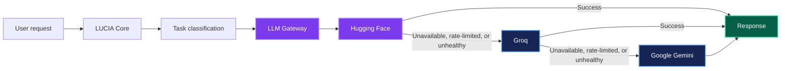
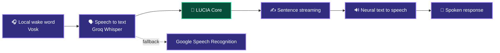
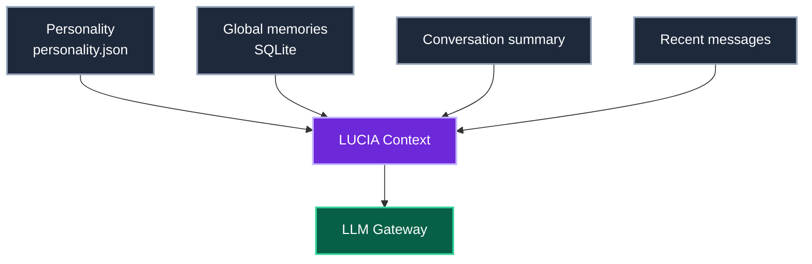
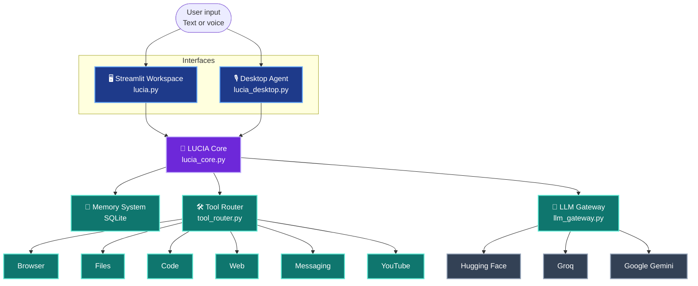

  <p>
    <strong>An intelligent, voice-first personal AI companion built for conversation, memory, automation, and resilient LLM orchestration.</strong>
  </p>

  <p>
    <a href="https://github.com/mahadiurrehman-pixel">
      
    </a>
    
    
    
  </p>

  <p>
    <a href="#-what-is-lucia">Overview</a>
    ·
    <a href="#-capabilities">Capabilities</a>
    ·
    <a href="#-architecture">Architecture</a>
    ·
    <a href="#-quick-start">Quick Start</a>
    ·
    <a href="#-security--privacy">Security</a>
    ·
    <a href="#-roadmap">Roadmap</a>
  </p>
</div>

---

## ✨ What is LUCIA?

**LUCIA** is a modular personal AI companion that unifies natural conversation, persistent memory, real-time voice interaction, Linux desktop automation, web capabilities, and multi-provider LLM reliability in one system.

Use it through either of its complementary interfaces:

| Interface | Best for |
|:--|:--|
| 🖥️ **Streamlit Workspace** | Rich, text-based conversations, coding support, controls, and streamed responses. |
| 🎙️ **Linux Desktop Agent** | Always-available, wake-word-driven voice interaction in the background. |

> **Built to stay adaptable.** The UI, AI core, memory, provider adapters, and system tools are isolated so each layer can evolve without forcing a rewrite of the rest.

---

## ⚡ Capabilities

<table>
<tr>
<td width="50%" valign="top">

### 🧠 Resilient LLM Gateway
A centralized provider gateway keeps LUCIA independent from any single model vendor.

- Automatic provider fallback
- Health tracking and cooldowns
- Rate-limit awareness
- Exponential-backoff retries
- Task-aware model selection
- Streaming and token-usage logging

</td>
<td width="50%" valign="top">

### 🎙️ Natural Voice Interaction
A complete voice pipeline enables hands-free conversations.

- Local Vosk wake-word detection
- Groq Whisper transcription
- Google Speech Recognition fallback
- Neural text-to-speech replies
- Urdu + English conversation support
- Sentence-level audio streaming

</td>
</tr>
<tr>
<td width="50%" valign="top">

### 💾 Long-Term Memory
SQLite-backed persistence gives conversations meaningful continuity.

- Preferences and personal facts
- Projects and background context
- Conversation summaries
- Recent-message awareness
- Memory across sessions and chats

</td>
<td width="50%" valign="top">

### 🛠️ Controlled Automation
A dedicated tool layer gives LUCIA practical desktop and web abilities.

- Browser, search, and YouTube tools
- Code and project-file generation
- Controlled file operations
- Live web-information retrieval
- Draft-first messaging workflows

</td>
</tr>
</table>

---

## 🧠 Multi-Provider Intelligence

LUCIA sends every model request through a single **LLM Gateway** rather than tying the application directly to one provider.

```text
Hugging Face  →  Groq  →  Google Gemini
     primary       fallback      fallback
```

| Task type | Typical use |
|:--|:--|
| `chat` | Natural, everyday conversations |
| `coding` | Code generation and project assistance |
| `reasoning` | Complex problem-solving tasks |
| `summary` | Context compression and concise recaps |

### Request resilience



The gateway is responsible for provider availability, retries, cooldowns, streaming, model selection, and usage logging—keeping provider-specific details out of the main application logic.

### Provider adapter contract

Every provider follows the same interface, making new integrations straightforward:

```python
class LLMProvider:
    def generate(self, ...): ...
    def stream(self, ...): ...
    def is_available(self, ...): ...
    def health_check(self, ...): ...
```

```text
providers/
├── base.py
├── huggingface_provider.py
├── groq_provider.py
└── gemini_provider.py
```

---

## 🎙️ Voice, Built for Real Conversations

LUCIA is designed to move naturally between text and speech.



### Wake word

The wake-word stage runs **locally** before cloud services are involved. Supported triggers include:

- `Lucia`
- `Hey Lucia`

Once awakened, LUCIA listens for a command, routes it through the core, invokes permitted tools when needed, and can answer aloud before the full response has finished generating.

---

## 💾 Context & Persistent Memory

Instead of repeatedly sending an entire chat history, LUCIA builds a focused context from the information that matters most.



The core consolidates system-level context into one compatible system message before handing it to a provider. This improves consistency across different chat templates while preserving LUCIA’s personality, relevant memories, and recent conversation state.

---

## 🛠️ Tools & Automation

| Tool family | What LUCIA can do |
|:--|:--|
| 🌐 **Browser** | Open websites and URLs, launch web applications, and perform searches. |
| ▶️ **YouTube** | Search videos, resolve streams, and open selected content in a browser. |
| 💻 **Code** | Generate code, create project files, and work in supported development directories. |
| 📁 **Files** | Read, create, write, and manage files within configured safe boundaries. |
| 🔎 **Web** | Retrieve current web information and send relevant findings into the reasoning pipeline. |
| 💬 **Messaging** | Prepare message drafts for supported platforms—never silently dispatch messages. |

---

## 🏗️ Architecture



### Project layout

```text
lucia/
│
├── lucia.py                    # Streamlit workspace
├── lucia_core.py               # Core context, memory & conversation logic
├── lucia_desktop.py            # Background Linux voice agent
│
├── llm_config.py               # Provider and model configuration
├── llm_gateway.py              # Routing, retries, health checks & fallback
│
├── database.py                 # SQLite persistence
├── personality.json            # Personality configuration
├── contacts.json               # Contact data
│
├── audio_engine.py             # STT, TTS & audio processing
├── tool_router.py              # Tool intent routing
│
├── providers/
│   ├── __init__.py
│   ├── base.py
│   ├── huggingface_provider.py
│   ├── groq_provider.py
│   └── gemini_provider.py
│
├── tools/
│   ├── browser_tools.py
│   ├── code_tools.py
│   ├── file_tools.py
│   ├── messaging_tools.py
│   ├── web_tools.py
│   └── youtube_tools.py
│
├── requirements.txt
├── .env                        # Local only — never commit this file
├── lucia.service               # User-level systemd service
└── run_lucia.sh                # Service runner
```

---

## 🚀 Quick Start

> **Linux desktop voice features:** LUCIA’s background voice agent is currently intended for Linux environments.

### 1. Install system dependencies

```bash
sudo apt update

sudo apt install -y \
  python3-pyaudio \
  portaudio19-dev \
  libasound2-dev \
  ffmpeg
```

### 2. Clone the project

```bash
# Change `lucia` if your repository uses a different name.
git clone https://github.com/mahadiurrehman-pixel/lucia.git
cd lucia
```

### 3. Create and activate a virtual environment

```bash
python3 -m venv .venv
source .venv/bin/activate
```

### 4. Install Python dependencies

```bash
pip install -r requirements.txt
```

### 5. Configure provider credentials

Create a `.env` file at the project root:

```env
HF_TOKEN=hf_your_token_here
GROQ_API_KEY=gsk_your_groq_api_key_here
GEMINI_API_KEY=your_gemini_api_key_here
```

LUCIA reads credentials from environment variables and determines which providers are currently available. Keep your secrets private:

```gitignore
# .gitignore
.env
.venv/
__pycache__/
*.pyc
```

---

## 🎧 Offline Wake-Word Setup

Download and extract the Vosk English model used by the local wake-word engine:

```bash
wget https://alphacephei.com/vosk/models/vosk-model-small-en-us-0.15.zip
unzip vosk-model-small-en-us-0.15.zip
rm vosk-model-small-en-us-0.15.zip
```

Keep the extracted model available to the desktop voice engine.

---

## ▶️ Run LUCIA

### Option A — Streamlit Workspace

```bash
streamlit run lucia.py
```

Open the address shown in your terminal to start a text-based, memory-aware workspace.

### Option B — Desktop Voice Agent

```bash
python3 lucia_desktop.py
```

Say the wake word, then speak naturally:

```text
“Lucia”
“GitHub kholo”
```

---

## ⚙️ Run as a Linux Service

To start the desktop agent automatically through a user-level `systemd` service:

```bash
# Make the launcher executable
chmod +x run_lucia.sh

# Create the user service directory
mkdir -p ~/.config/systemd/user

# Install the service definition
cp lucia.service ~/.config/systemd/user/

# Reload, enable, and start it
systemctl --user daemon-reload
systemctl --user enable lucia.service
systemctl --user start lucia.service
```

Useful service commands:

```bash
# Check current status
systemctl --user status lucia.service

# Follow live logs
journalctl --user -u lucia.service -f
```

---

## 🗣️ Command Gallery

| Capability | Example command |
|:--|:--|
| Wake word | `Lucia` |
| YouTube | `YouTube par Atif Aslam ka gaana chalao` |
| Web search | `Google se LangChain ke bare mein search karo` |
| Open a site | `GitHub kholo` |
| Coding | `Python mein camera script banao` |
| File operations | `Desktop par script.py banao` |
| Messaging | `Ali ke liye WhatsApp message draft karo` |
| Stop speaking | `Lucia chup ho jao` |

---

## 🔒 Security & Privacy

LUCIA is designed with practical boundaries around local system interaction.

| Principle | How it is applied |
|:--|:--|
| **Scoped filesystem access** | File operations are limited to configured safe directories rather than unrestricted system access. |
| **Draft-first messaging** | Messages are prepared for review; they are not silently dispatched. |
| **Local wake-word detection** | Vosk detects the wake word locally before cloud AI processing begins. |
| **Private credentials** | API keys live in environment variables and must never be committed to version control. |
| **Modular tools** | System capabilities live behind a dedicated routing layer, allowing clear permission boundaries. |

---

## 🧪 Reliability by Design

A provider outage should not take down the assistant.

```text
LUCIA
  │
  ├─ Hugging Face ── success ──► Response
  │          │
  │          └─ failure ───────► Groq ── success ──► Response
  │                                      │
  │                                      └─ failure ─► Gemini ─► Response
```

Each provider’s health is tracked independently. Temporarily unhealthy providers can enter a cooldown period before the gateway retries them later, helping LUCIA remain useful during rate limits and service interruptions.

---

## 🛣️ Roadmap

LUCIA is actively evolving. Areas of interest include:

- [ ] Additional LLM providers
- [ ] Provider benchmarking and smarter task routing
- [ ] Better latency optimization
- [ ] Expanded desktop automation
- [ ] More capable memory management
- [ ] Stronger tool permissions
- [ ] Improved observability and analytics
- [ ] More advanced local-AI capabilities

---

## 🤝 Contributing

Ideas, improvements, and bug reports are welcome.

When contributing, please keep the architecture clean:

1. Keep provider-specific code inside `providers/`.
2. Keep fallback and routing behavior inside `llm_gateway.py`.
3. Avoid coupling UI code directly to a specific LLM provider.
4. Keep system automation isolated inside `tools/`.
5. Never commit API keys, `.env` files, or private data.
6. Test fallback behavior before opening a pull request.

---

## 📄 License

Distributed under the **MIT License**. See [`LICENSE`](LICENSE) for more information.

---

<div align="center">
  <p>
    Crafted with curiosity by
    <a href="https://github.com/mahadiurrehman-pixel"><strong>@mahadiurrehman-pixel</strong></a>
  </p>
  <p>
    <sub>Build an assistant that listens, remembers, and helps—without being locked to a single provider.</sub>
  </p>
</div>
